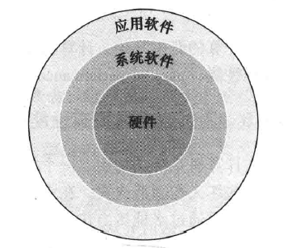
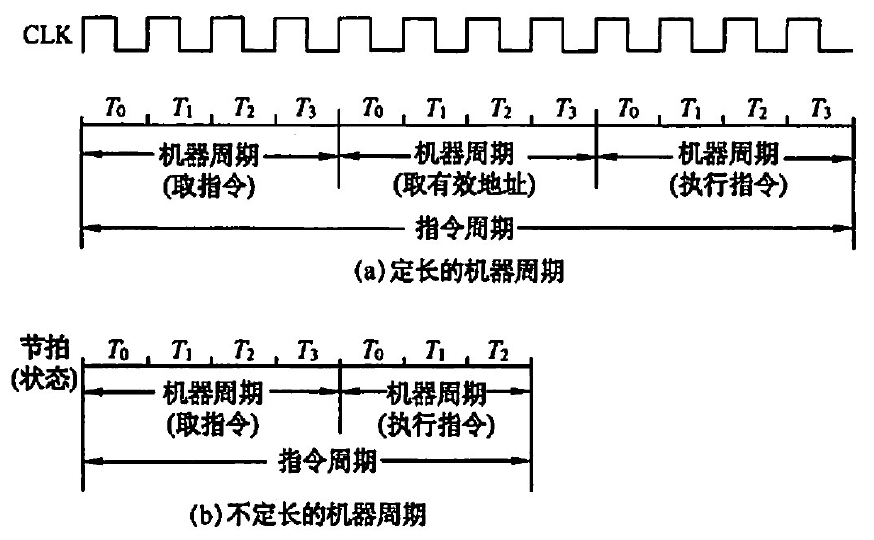

# 计算机概要和技术

## 程序概念入门

一个典型的程序往往由几百万行代码构成, 并依靠软件库实现一场复杂的功能. 但是计算机硬件只能执行极为简答的低级指令, 从复杂的应用程序到复杂的指令需要经过几个软件层次来将复杂的高层次操作逐步解释或者翻译成简单的机器指令. 

下面是简化的硬件和软件层次图:

系统软件可以细分为:

- 操作系统
- 编译程序
- 加载程序
- 汇编程序

其中, 操作系统和编译程序对于现代的计算机来说是必须的, 操作系统是用户程序和硬件之间的接口, 为用户提供多种服务和监控功能, 其最为重要的作用是:

- 处理I/O
- 分配内存
- 为多个应用程序提供共享计算机资源的服务

编译程序完成的是另一项重要的功能: 把高级语言编写的程序翻译成硬件能执行的指令

由于第一代程序员发现, 使用二进制(即机器码)和计算机通信十分乏味, 所以他们发明了一种助记符(即汇编语言), 来代替那些二进制代码, 用这些汇编语言写成的程序叫做汇编程序

## 硬件概念入门

任何一台计算机都要处理四项相同的基本功能: 输入数据\输出数据(即I/O)\处理数据(即CPU)\存储数据(即cache\内存\外存), 后面几章将会基于上述的功能展开

计算机是由五个经典部件组成的:

- 输入
- 输出
- 存储器
- 数据通路(ALU)
- 控制器

后面的两个部件通常合称为处理器

### 显示器

#### LCD

大多数个人移动设备都用液晶显示(Liquid Crystal Display, LCD)来获得轻巧低功耗的显示效果.

它用液体聚合物薄层的带电或者不带电来传输或者阻止光线的传输. 当施加电压的时候, 屏幕呈现黑色; 不施加电压的时候, 屏幕呈现白色.

动态矩阵显示技术: 每个像素都由一个晶体管精确地控制电流. 如果你想要彩色地效果, 则需要有一个红-绿-蓝屏来决定三种颜色分量的强度, 每个点需要**3**个晶体管开关.

#### 像素

图像由像素矩阵构成, 可以表示成二进制位的矩阵, 称为位图(bit map)

针对不同的屏幕尺寸和分辨率(常见的有4K, 即3840*2160), 屏幕中显示矩阵的大小也在发生变化

彩色显示器使用8位来表示三原色, 也就是说, 每一种不同的颜色由24bit来表示, 可以表示2^24种颜色(当然现在的显示器还有10bit, 看具体情况而定)

计算机采用光栅刷新缓冲区(又称为帧缓冲区)来保存位图来支持图像. 要显示的图像保存在帧缓冲中, 每个像素的二进值以刷新率读出到显示设备.

### 打开机箱

主板上有以下东西:

- 处理器(central processor unit): 分为数据通路(WTF, 直接说ALU不好吗)和控制器
- Cache(WTF, cache不是集成在CPU里面的吗?)
- 内存: 存放正在运行的程序/数据, 由DRAM构成, 芯片需要不断刷新, 防止掉电导致信息损失
- I/O接口

#### 指令集体系结构

ISA(Instruction Set Architecture)是硬件和底层软件之间的抽象接口, 包含正确编写机器语言程序所需的所有信息, 包含指令\寄存器\存储访问\I/O等. 它又称为指令集或者指令集体系, 是计算机体系结构中与程序设计有关的部分, 包含了基本的数据类型, 指令集, 寄存器, 寻址模式, 存储体系, 终端, 异常处理以及外部I/O.  指令集架构包含了一系列的opcode即操作码(机器语言), 以及由特定处理器执行的基本命令. 

要注意的是, 指令集体系与微架构不同, 使用不同微架构的电脑可以共享一种指令集, 如Intel的Alder Lake结构和AMD的zen3架构, 两者都采用相同版本的x86指令集, 但是两者在内部设计上有本质的区别. 上述的文字体现的是计算机设计者将体系结构(ISA)和体系结构的实现(也就是上述的微架构)分开考虑. 硬件的实现方式必须按照体系结构的抽象, 故"实现"就是遵循体系结构的硬件.

为了帮助程序员不分心, 我们必须隐藏低层次的细节, 故设计者提供了一种基本指令集和操作系统接口(ISA+系统软件), 叫做应用二进制接口ABI(Application Binary Interface).

### 数据的安全储存(内存外存)

- 高速缓冲存储器: 简称cache, SRAM, 易失存储芯片, 无需刷新维持信息
- 主存储器: 简称主存, 又称为内存, DRAM, 易失存储芯片, 需要刷新维持信息
- 辅助存储器: 简称辅存, 又称为外存或者二级存储, 一般我们常用的是磁盘(硬盘)和闪存(U盘\SD卡\固态硬盘等), 前者是磁介质存储器, 后者是半导体介质存储器.

处理器和存储制造技术的发展趋势: 容量越来越大, 性能越来越好, 价钱越来越便宜

## 性能(performance)

### 机器字长

机器字长是指计算机进行一次整数运算所能处理的二进制数据的位数, 通常与CPU的寄存器位数\加法器有关, 机器字长越长, 数字的表示范围越大, 计算的精度越高, 计算机字长通常是8的整数倍.

### 数据通路带宽

数据通路带宽指的是数据总线一次所能传送信息的位数, 这个数据通路带宽指的是外部总线的带宽, 不是CPU内部总线的带宽.

### 主存容量

主存容量是主存储器(内存)的最大容量, MAR反应的是有多少地址(有多少个房间), 2^MAR的字节数就是房间的总数, MDR反应的是存储单元的位数(房间中能容纳几个人), 2^MAR的位数*MDR的位数就是主存容量.

### 运算速度

#### 响应时间

计算机完成某任务需要的总的时间(和操作系统调度算法的响应时间有区别), 包括硬盘访问\内存访问\I/O\操作系统开销和CPU执行时间等.

#### 吞吐率

也叫做带宽, 单位时间内完成的任务的数量.

下面两种改进计算机系统的方式能否增加吞吐率或者减少响应时间?

> 方式1: 将计算机中的处理器更换为更告诉的型号. 可以, 因为降低响应时间的同时, 吞吐率几乎都是降低的.
>   方式2: 采用核心更多的处理器. 不会, 不会使某个任务完成的更快, 只是增加了吞吐率, 但是当任务数大于核心数量的时候, 会有进程处于就绪态, 所以更多的核心会减少排队等待的时间, 同时改进了响应时间.

#### 性能

性能 = 1/执行时间

响应时间分为CPU(执行)时间和等待I/O等或者多任务时其他程序运行的时间.

注意, 这里的执行时间是指CPU(执行)时间, 包括用户CPU时间(程序本身花费的时间)+系统CPU时间(操作系统时间), 这两者难以区别, 后者是操作系统为用户服务花费的CPU时间. 由此, 又衍生出两种性能指标: 

- 系统性能: 空载系统响应时间, 对应系统CPU时间
- CPU性能: 对应用户CPU时间

为了度量计算机完成基本功能的速度, 我们需要将CPU性能与下面的两个量建立关联:

- 时钟周期: 计算机一个时钟周期的时间, 通常是处理器时钟, 常数
- 时钟频率: 1/时钟周期

> 时钟周期\机器周期\指令周期的关系: 时钟周期是CPU的最小时间单位, CPU在每个时间周期内只能做一件事情, 也有一个一般性的称呼, 叫做"节拍". 机器周期是指完成一个任务所需要的时间, 打个比喻, 一辆轿车, 加速分为几个部分, "加油"\"点火"\"传动", "加油"这个部分就是机器周期, 可能由几个时钟周期构成, "点火"\"传动"都是类似的. 而指令周期就是汽车加速的整个过程, 即"加油\点火\传动"总的时间. 可见下图:
>   
 

如时钟频率为4.0GHz(4000MHz, 或者说4.0*10^9Hz)

